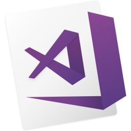

# EchoesOfExistence

<h1 align="center">
  
</h1>

<h5 align="center">
  <code><a href="https://www.linkedin.com/in/dakshgorajiya/" title="LinkedIn Profile"> LinkedIn</a></code>
  
</h5>
 
I am a Full Stack Developer currently leading the Tech at MyWays.ai with a mission to revolutionize how the world hires with AI. 🚀

I have a passion for problem-solving and pioneering first-principle thinking, driven by purpose and fueled by the challenge of finding solutions, with a strong foundation in Javascript, Nodejs, MongoDB, React, Nextjs, AWS, etc. I've led diverse tech teams covering Frontend, Backend, Machine Learning and DevOps and building scalable products from scratch with the commitment to making a positive impact through technology.

I'm an explorer of new tech, an avid learner, and a problem-solver at heart. When I'm not in code, you'll find me watching tech-related YouTube videos, fueling my curiosity.

Feel free to connect with me @iampavangandhi for all things tech or just to say hello! Let's shape the future of tech together. 🌟

Joined Github **6** years ago.

Since then I pushed **3469**+ commits, opened **229**+ issues, submitted **550**+ pull requests, created **20**+ gists and contributed to **6**+ public repositories.

<h2 align="center">🔥 Languages & Frameworks & Tools & Abilities 🔥</h2>
 

  <code></code>
<!--   <code></code>
  <code></code> -->
  <code></code>
  <code></code>
  <code></code>
  <code></code>
  <code></code>
  <code></code>
<!--   <code></code>
  <code></code> -->
  <code></code>
  <code></code>
<!--   <code></code> -->
  <code></code>
<!--   <code></code> -->
  <code></code>
  <code></code>
<!--   <code></code> -->
  <code></code>
  <code></code>
  <code></code>
<!--   <code></code>
  <code></code> -->
  <code></code>
  <code></code>
  <code></code>
  <code></code>
  <code></code>

<h2 align="center">⚡ Stats ⚡</h2>
 

  

    
    
  

           
  

    
  

   

  

**zumrudu-anka/zumrudu-anka** is a ✨ _special_ ✨ repository because its `README.md` (this file) appears on your GitHub profile.

Here are some ideas to get you started:

- 🔭 I’m currently working on ...
- 🌱 I’m currently learning ...

